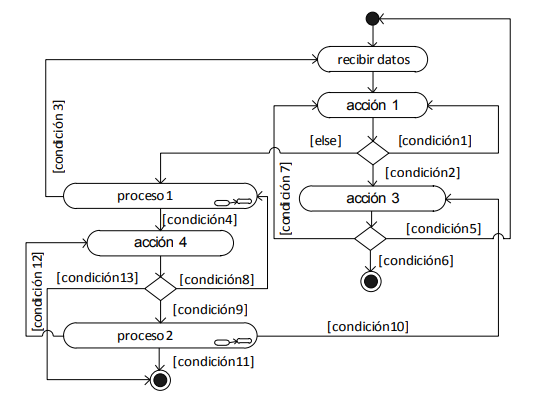

# Tema 1 - Introducción

El objetivo de la asignatura es que al concluir la misma el estudiante esté capacitado para resolver problemas, mediante la elaboración de programas desarrollados aplicando, de manera eficaz y eficiente, los fundamentos de la programación estructurada en el análisis, diseño e implementación de los mismos.

En los primeros días de la informática los programas eran elaborados directamente en lenguaje de máquina (o en ensamblador). El lenguaje de máquina incentiva y prácticamente obliga al uso de saltos dentro del programa
(hacia adelante y hacia atrás). Esta práctica suele da lugar a una lógica
confusa que al ser representada en un diagrama revela una gran cantidad de
líneas que se cruzan y entrelazan por lo que se conoce como “lógica tipo
espagueti”:

Puesto que la mayoría de los programadores surgieron de ese ambiente, los primeros lenguajes de alto nivel (como Fortran, Basic y C) tenían (y aún tienen) un comando para realizar este tipo de saltos: el comando “goto”.

El problema surge cuando es necesario corregir, modificar y/o ampliar un programa, actividades inevitables en la producción de software y que, si no han sido convenientemente planificadas, consumen más tiempo y más recursos
que la elaboración del producto original.

Para un mantenimiento eficiente del software es imprescindible que la lógica de los diferentes programas que lo componen sea **fácilmente comprensible**, pues de lo contrario resulta más práctico elaborar un nuevo programa que tratar de entender y luego corregir el programa existente.

Es con este objetivo, el de facilitar el mantenimiento de software, que surge la Programación Estructurada (PE), la cual recoge las prácticas de programación que habían demostrado ser exitosas en la elaboración y mantenimiento de programas y que se resumen en los siguientes principios:

* **Dividir** un problema complejo en problemas más sencillos.

* Emplear **estructuras estándar** para construir la totalidad del programa.

* Emplear **tipos de datos a la medida**.

Si bien hoy en día los ambientes de desarrollo son en su mayoría orientados a objetos, los principios de la programación estructurada siguen siendo válidos dentro de los nuevos paradigmas y por lo tanto siguen siendo de utilidad práctica.

Pero la importancia de la programación estructurada no sólo es histórica, sino que sigue siendo de utilidad práctica, tanto así que, el núcleo de todos los sistemas operativos actuales, como Windows, Linux y Androide, son programa estructurados (no orientados a objetos).

### La Programación modular (Descendente)

El primer principio, de la programación estructurada es conocido también como **programación modular** o **programación descendente**. Su aplicación es universal y expresa la misma intención que la frase “divide y vencerás”. Básicamente nos dice que se debe dividir un problema en problemas más pequeños y estos a su vez en otros, hasta que los mismos sean lo suficientemente sencillos como para ser resueltos independientemente.

Cada uno de los problemas en los que es dividido el problema principal se conoce como **módulo** y es la razón por la cual este principio es conocido también con el nombre de **“programación modular”**.

>Es importante aclarar que un módulo es considerado como tal sólo si resuelve **el problema de manera independiente**, es decir sin importar de donde vengan los datos ni donde o como vayan a ser empleados los resultados devueltos.

Este principio se conoce también como programación descendente (top-down) porque se parte de un problema complejo que se divide en problemas más sencillos, estos en otros más sencillos y así sucesivamente, descomponiendo el problema de arriba (del problema más complejo) hacia abajo (al problema más sencillo). No obstante, la solución por lo general es ascendente, pues se comienza por resolver los problemas más sencillos y se va subiendo en dirección a los problemas más complejos.

El dividir el problema en problemas más sencillos, facilita considerablemente el mantenimiento de los programas y e incentiva la reutilización de código. Un módulo que resuelve un problema específico, al ser independiente, puede ser empleado no sólo en el software para el cual fue elaborado, sino también en cualquier otro en el que se requiera resolver ese tipo de problema, de esa manera surgen las librerías que contienen módulos que pueden ser reutilizados en varios programas, reduciendo considerablemente el tiempo de desarrollo.

Además los módulos facilitan enormemente el mantenimiento y detección de errores, porque si en la elaboración de un programa se emplean módulos previamente probados y se produce un error, se sabe que el error no está en dichos módulos, sino en los módulos añadidos, e inclusive es relativamente sencillo identificar el módulo problemático, con lo que la corrección se reduce a la corrección de un sólo módulo.
