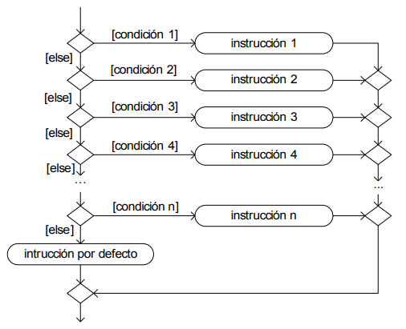
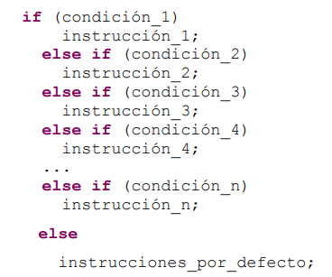
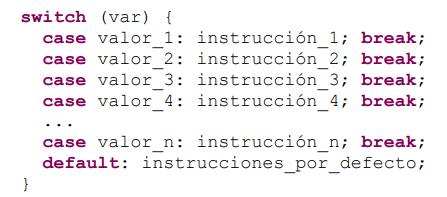

# Tema 3 - Selección

## 🧠 Fundamentos de C++: selección, lógica y control de flujo

En este resumen repasamos estructuras y conceptos básicos en C++ que te ayudan a escribir programas limpios, claros y eficientes.

---

### 🔍 Expresiones lógicas

Una **expresión lógica** (o condicional) siempre devuelve `true` o `false`.  
En C++, puedes usar:

- `bool`: tipo lógico con valores `true` o `false`
- También es válido: `0` = falso, `1` (o cualquier número distinto de cero) = verdadero

#### 🔗 Operadores relacionales

| Operador | Significado             |
|----------|--------------------------|
| `==`     | Igual                   |
| `!=`     | Distinto                |
| `>`      | Mayor                   |
| `<`      | Menor                   |
| `>=`     | Mayor o igual           |
| `<=`     | Menor o igual           |

#### ⚙️ Operadores lógicos

| Operador | Función                             |
|----------|-------------------------------------|
| `!`      | Negación (`true` → `false`, y viceversa) |
| `&&`     | "AND" Y lógico (ambos deben ser verdaderos) |
| `\|\|`     | "OR" O lógico (basta que uno sea verdadero) |

---

### 🧭 Estructura Condicional "Simple" `if`

Permite ejecutar una acción si la condición se cumple, si no no ejecuta el bloque.

```cpp
...
if (condición) {
  // Si la condición es "true" ...
}
...
```

### 🧭 Estructura Condicional "Doble" `if-else`

Permite ejecutar una acción si se cumple una condición y otra si no.

```cpp
...
if (condición) {
  // instrucción_1
  // ...
} else {
  // instrucción_2
  // ...
}
...
```

- Si hay más de una instrucción por bloque, usa llaves `{}`.
- El `else` es opcional.
- Puedes **anidar** `if-else`, pero se recomienda no más de 3 niveles para mantener la claridad.

---

### ➕ Operadores de incremento y decremento

Sirven para aumentar o disminuir una variable en 1 unidad:

| Operador | Equivalente      |
|----------|------------------|
| `x++`    | `x = x + 1`      |
| `x--`    | `x = x - 1`      |
| `++x`    | `x = x + 1`      |
| `--x`    | `x = x - 1`      |

🧠 **Diferencias entre prefijo y posfijo**:

```cpp
int y = 4;
int x = ++y * 2; // Resultado: x = 10 (incrementa antes)
int z = y++ * 2; // Resultado: z = 8  (incrementa después)
```

##### Ejemplos

#### Ej. 1.

**Elabore un programa que, empleando librerías C++, determine si un número dado es par, impar o cero. El programa debe contar con un módulo que devuelva 0 si el número es cero, 1 si es impar y 2 si es par.**

En este problema se identifican los siguientes módulos (primer principio de la programación estructurada):

a) Un módulo para leer el número;

b) Un módulo para determinar si el número es par, impar o cero y

c) Un módulo para mostrar el resultado.

En cuanto a la lógica, para determinar si un número es par, simplemente
se divide entre 2 y si el residuo es cero, entonces el número es par, caso
contrario (si es uno) es impar.


El problema surge cuando el numero es cero (pues el residuo de 0 entre 2 es también 0), por ello, para determinar si un número es par, impar o cero, primero se debe averiguar si el número es cero y si no determinar si es par o impar.


### 🔍 Estructura Switch e If - Else If

Cuando la lógica que resuelve el problema implica dos o más condiciones consecutivas, donde el caso contrario es siempre otra condición, tal como se muestra en el siguiente diagrama:



La forma más clara de codificarla es mediante la estructura “if – else if”, que simplemente es la estructura “if”, pero ordenada de manera que se puedan ver claramente las diferentes condiciones:



### Estructura condicional con múltiples casos (`if`, `else if`, `else`)

Como se muestra en el diagrama:

- Si **una de las condiciones** se cumple, se ejecuta **su bloque correspondiente** y luego el programa continúa normalmente con la siguiente instrucción.
- Si **ninguna condición** es verdadera, se ejecuta el bloque por defecto: el último `else`.

> 💡 Al igual que en una estructura `if-else` estándar, el bloque `else` **es opcional**. Si no se incluye, simplemente no se ejecuta nada especial y el programa sigue con lo que venga.

---

### Uso de llaves `{}` para bloques

- Si hay **más de una instrucción** que debe ejecutarse cuando una condición se cumple, estas deben encerrarse **entre llaves `{}`** para formar un bloque.
- Esto asegura que todas las instrucciones se ejecuten como una sola unidad.

---

### Comparación por igualdad

Cuando se evalúa el mismo valor (una variable o expresión) contra distintos valores fijos —como números enteros, caracteres, valores enumerados, etc.— podemos usar estructuras tipo `switch` o múltiples `if-else` para organizar mejor la lógica condicional.


Una forma más clara y eficiente de programarla es con estructura “switch”:



#### Ej. 2.


